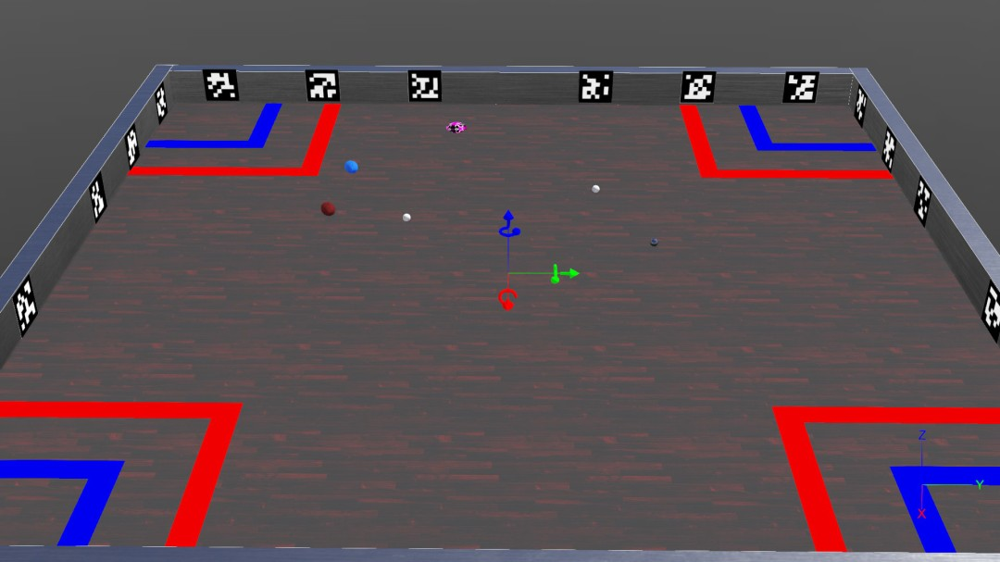
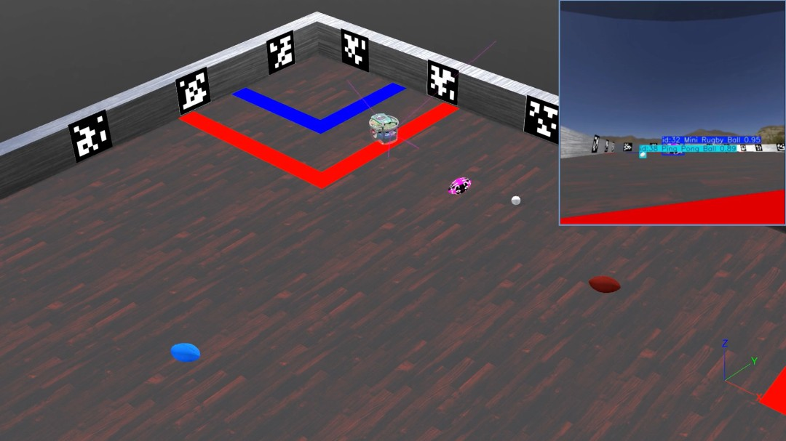
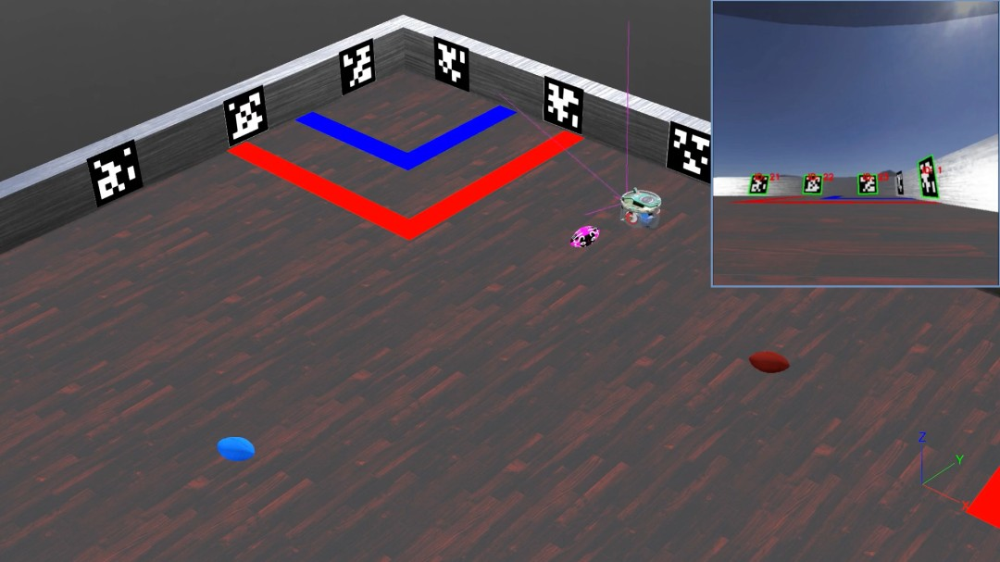
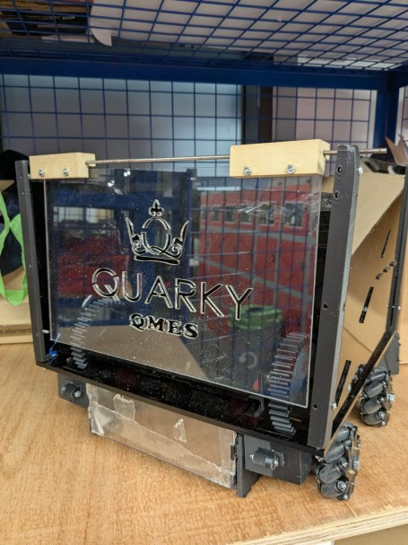
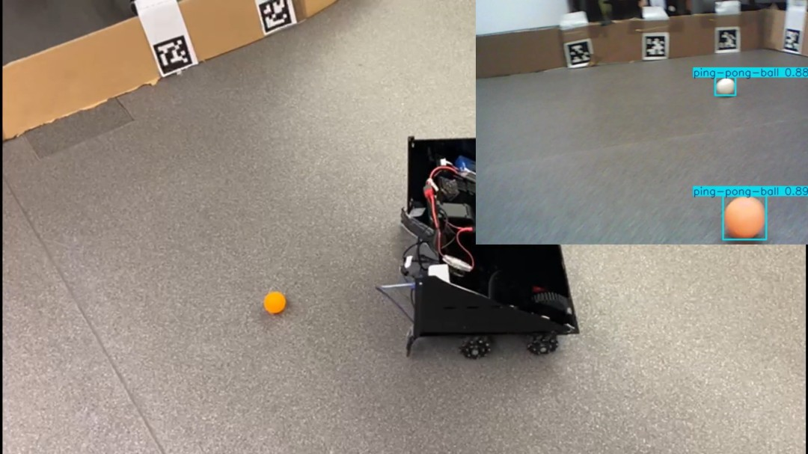
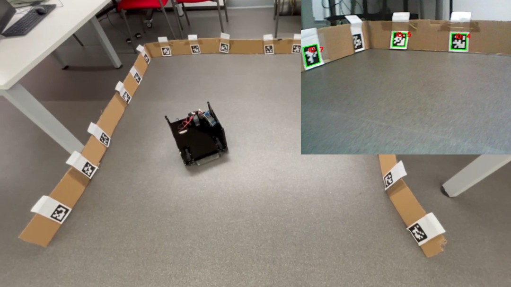
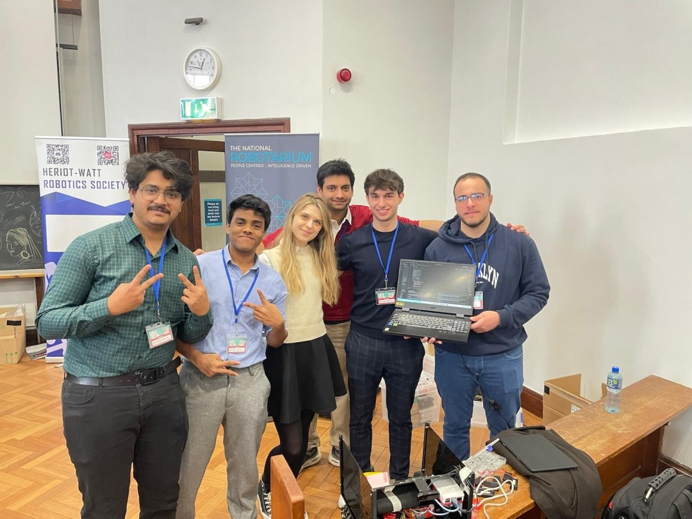

# Unibots

# How to Run WeBots Simulation in 5 Minutes
## Setup Conda Environment
- Important: pupil-apriltags works best on Python 3.10
1) git clone git@github.com:serhalahmad/unibots.git
2) cd unibots
3) conda create -n unibots-env python=3.10 -y
4) conda activate unibots-env
    - if 'conda init' before 'conda activate' error
    - Just type:
        - 'source ~/anaconda3/etc/profile.d/conda.sh' 
        - 'conda activate base'
        - 'conda activate unibots-env'
5) pip install -r requirements.txt
6) cd src\simulation\webots-files\main-env\controllers\controller_simulation
7) python controller_simulation.py (to check if no import errors occur)
8) Simulation:
    a. Tools -> Preferences -> Python command: Enter the path to the conda env's python.exe (e.g. C:\Users\Karl\anaconda3\envs\unibots-env\python.exe)
9) Hit "Play" in WeBots

## Simulation Image Previe
### Digital Twin Competition Arena

### Object Tracking And Chasing Balls

### April Tag Detection to Return Home

## Real Robot Preview
### Our 3D-printed Robot

### Object Tracking And Chasing Balls

### April Tag Detection to Return Home

## Our Team
